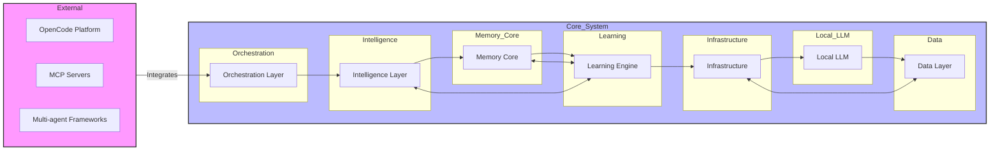
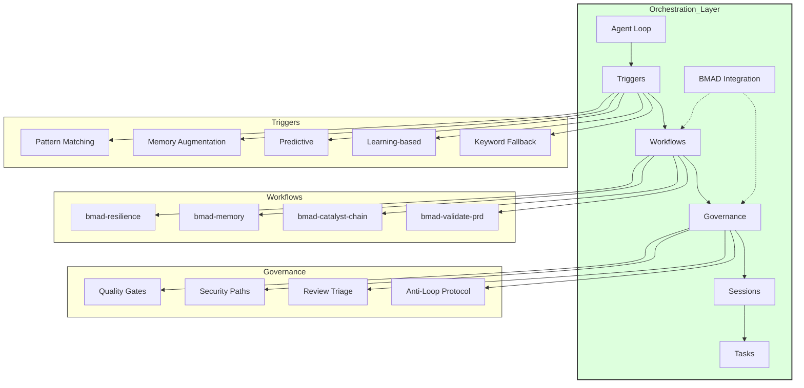
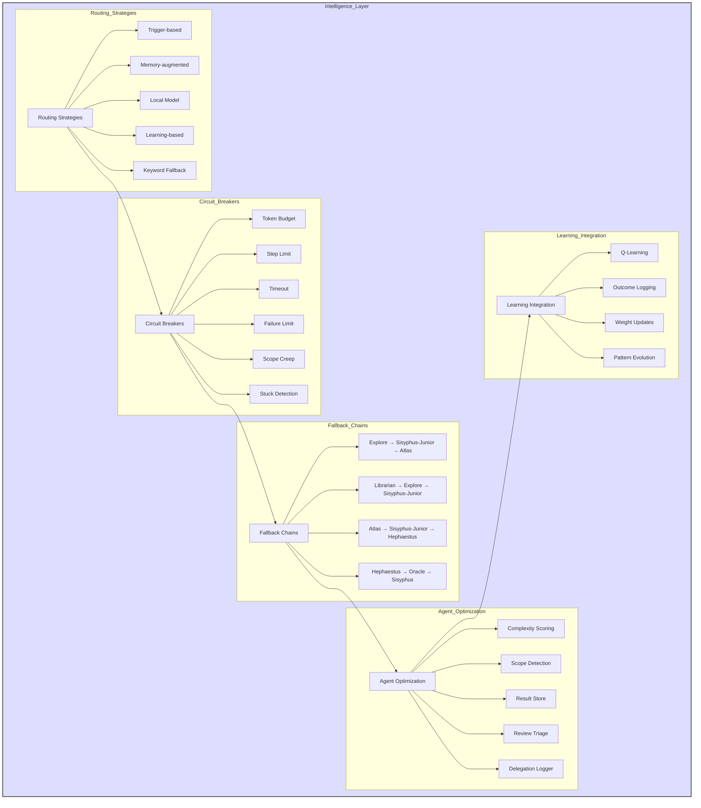
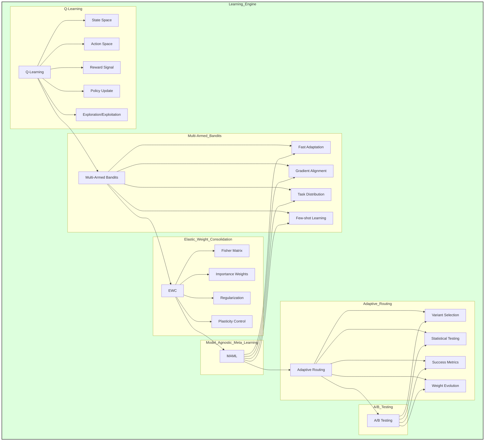
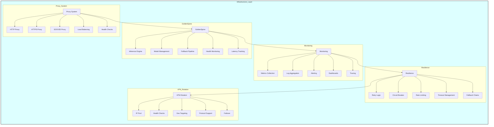
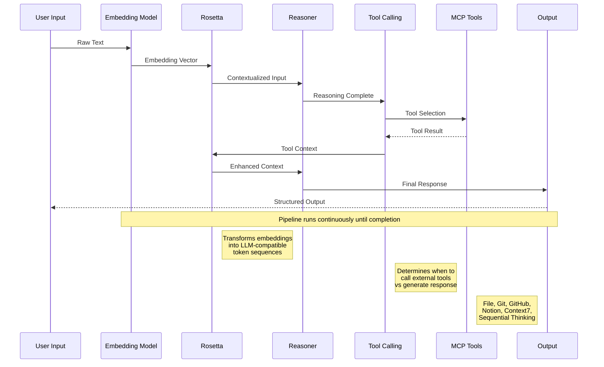
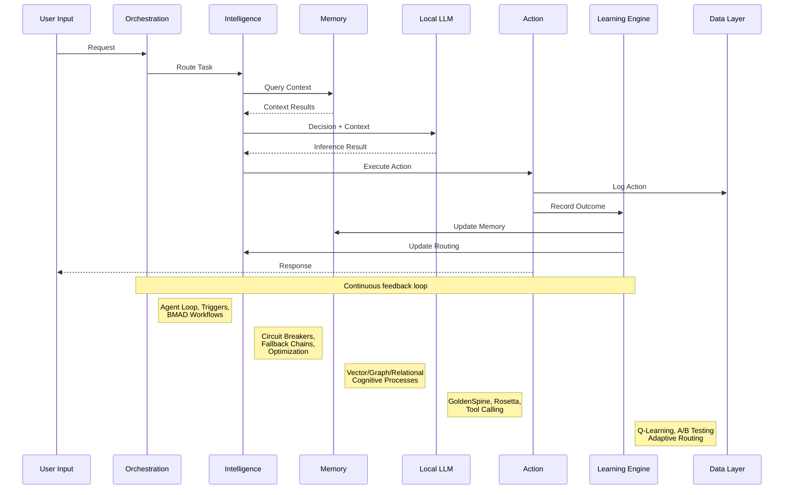

# N-Xyme MIND System Architecture Diagrams

This document contains Mermaid diagrams illustrating the core architecture of the N-Xyme MIND system.

---

## 1. System Overview

---

## 2. Orchestration Layer

---

## 3. Intelligence Layer

---

## 4. Memory Layer

```mermaid
flowchart TB
    subgraph Memory_Layer
        direction TB
        
        ST[Storage] --> RT[Retrieval]
        RT --> CP[Cognitive Processes]
        
        subgraph Storage
            direction LR
            VS[Vector Store] --- GS[Graph Store] --- RS[Relational Store]
            
            V1[Semantic Search]
            V2[Embedding Cache]
            V3[Index Management]
            
            G1[Knowledge Graph]
            G2[Entity Relations]
            G3[Path Finding]
            
            R1[SQLite Persistence]
            R2[Session State]
            R3[Outcome Logs]
            
            VS --> V1
            VS --> V2
            VS --> V3
            GS --> G1
            GS --> G2
            GS --> G3
            RS --> R1
            RS --> R2
            RS --> R3
        end
        
        subgraph Retrieval
            direction LR
            RTR[Semantic Search] --- RRM[Memory Search] --- RFR[Forgetting Recall]
            
            RT1[Unified Memory]
            RT2[Athena Context]
            RT3[Session Recall]
            RT4[TEMPR Search]
            
            RTR --> RT1
            RTR --> RT2
            RRM --> RT3
            RRM --> RT4
        end
        
        subgraph Cognitive_Processes
            direction LR
            
            CP1[Forgetting] --> CP2[Priority]
            CP2 --> CP3[Sleep]
            CP3 --> CP4[Retention]
            CP4 --> CP5[Reconsolidation]
            CP5 --> CP6[Trust]
            
            subgraph Forgetting
                F1[TTL Management]
                F2[Importance Decay]
                F3[Access Tracking]
            end
            
            subgraph Priority
                P1[Recency Score]
                P2[Access Frequency]
                P3[Relevance Weight]
            end
            
            subgraph Sleep
                S1[Consolidation]
                S2[Memory Transfer]
                S3[Schema Formation]
            end
            
            subgraph Retention
                R1[Importance Threshold]
                R2[Emotional Tagging]
                R3[Pattern Detection]
            end
            
            subgraph Reconsolidation
                RC1[Memory Update]
                RC2[Context Refresh]
                RC3[Association Rebuild]
            end
            
            subgraph Trust
                T1[Confidence Score]
                T2[Source Verification]
                T3[Consistency Check]
            end
            
            CP1 --> F1
            CP1 --> F2
            CP1 --> F3
            CP2 --> P1
            CP2 --> P2
            CP2 --> P3
            CP3 --> S1
            CP3 --> S2
            CP3 --> S3
            CP4 --> R1
            CP4 --> R2
            CP4 --> R3
            CP5 --> RC1
            CP5 --> RC2
            CP5 --> RC3
            CP6 --> T1
            CP6 --> T2
            CP6 --> T3
        end
    end

    style Memory_Layer fill:#fdd,stroke:#333,stroke-width:2px
    style Storage fill:#fee,stroke:#333,stroke-width:1px
    style Retrieval fill:#fee,stroke:#333,stroke-width:1px
    style Cognitive_Processes fill:#fee,stroke:#333,stroke-width:1px
```

---

## 5. Learning Engine

---

## 6. Infrastructure Layer

---

## 7. Local LLM Pipeline

---

## 8. Data Flow

---

## Architecture Summary

The N-Xyme MIND system is built on 7 interconnected layers:

1. **Orchestration Layer**: Manages agent loops, triggers, and workflow execution via BMAD integration
2. **Intelligence Layer**: Provides intelligent routing with circuit breakers, fallback chains, and learning integration
3. **Memory Core**: Stores and retrieves data across vector, graph, and relational stores with cognitive processes
4. **Learning Engine**: Continuously improves routing and agent selection through Q-learning and adaptive strategies
5. **Infrastructure**: Provides resilient infrastructure with proxy systems, GoldenSpine inference, and monitoring
6. **Local LLM Pipeline**: Processes user input through embedding, reasoning, and tool calling stages
7. **Data Layer**: Persists all system state including session history, outcomes, and learned patterns

The data flow forms a continuous feedback loop where user inputs traverse the entire system, with the learning engine continuously optimizing based on outcomes.